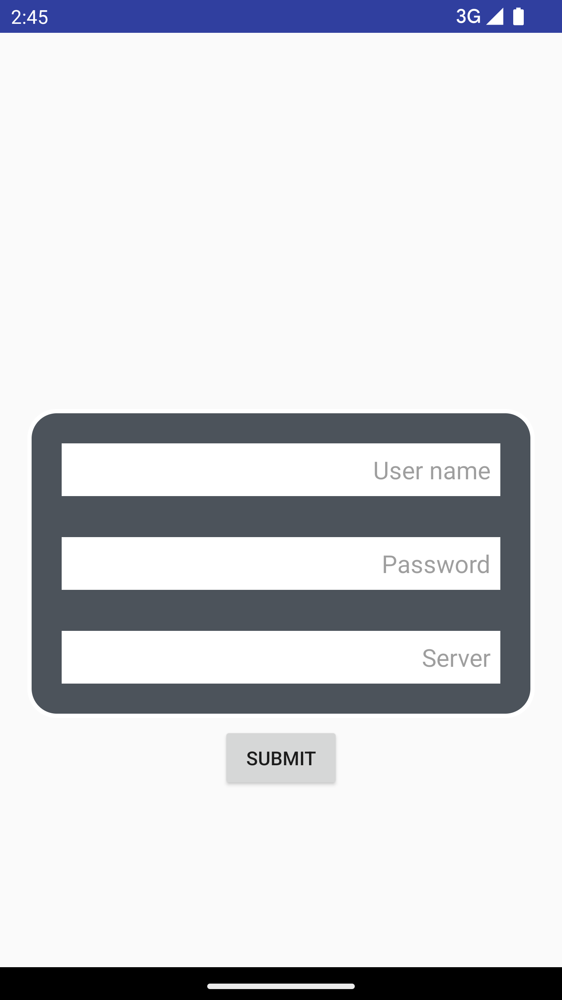
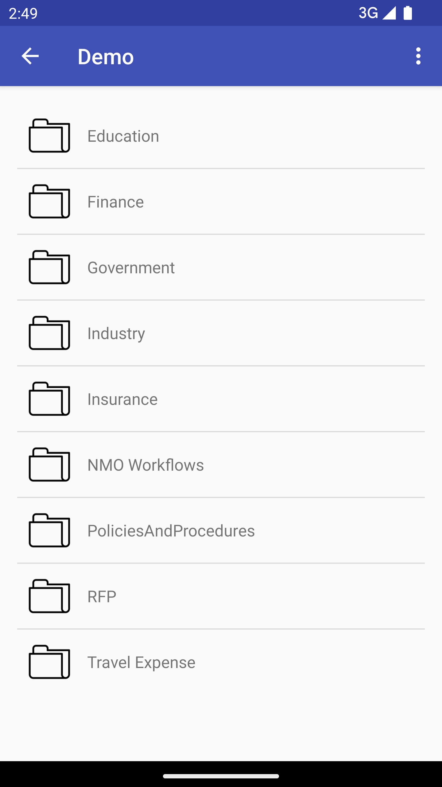
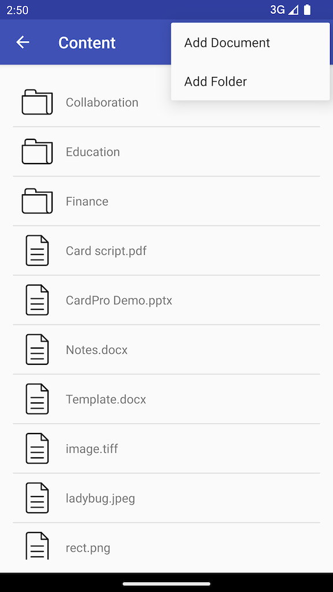
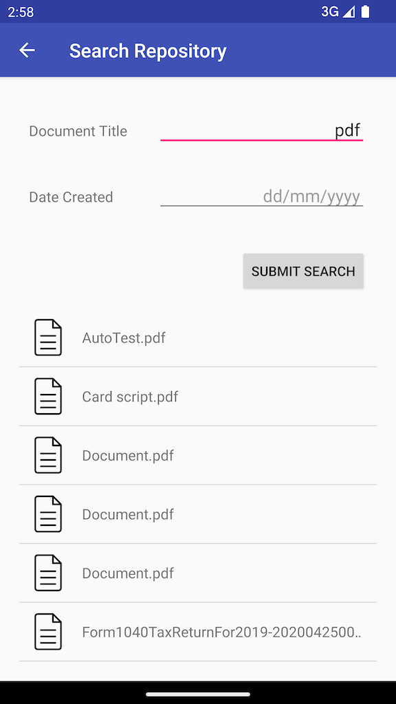

# IBM Navigator Mobile Sample

Sample Application to demonstrate the features of IBM Navigator Mobile Android SDK

The IBM Navigator Mobile Android SDK jar and its dependency jar files are required to compile the sample app. You can obtain the latest jar files from this link: https://www.ibm.com/support/fixcentral/swg/selectFixes?parent=Enterprise%20Content%20Management&product=ibm/Information+Management/Enterprise+Content+Management+Mobile&release=All&platform=Android&function=all

## Usage

Create a "libs" folder under the "SampleApp" directory and place the IBMECMCore.jar and its dependency jars into the "/SampleApp/libs" folder. The build.gradle file already has a reference to the SDK jars. You can connect only to IBM Content Navigator Version 3.0.11 or later (more information [here](https://www.ibm.com/docs/en/content-navigator))

## Documention
The Javadocs can be found in the SDK.

## Screenshots

### Login

### Browse

### Search

## License
See the [License agreement](/Ready%20Apps%20open%20source%20license.pdf) for more information about how this application is licensed.

